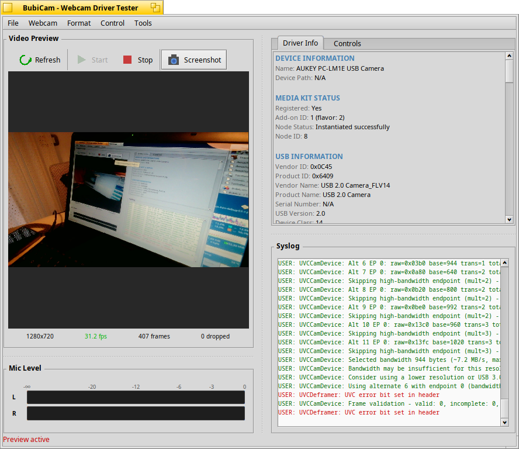

# UVC Webcam Driver for Haiku OS

A USB Video Class (UVC) media add-on for Haiku OS that provides webcam support for video conferencing and capture applications.




## Supported Hardware

This driver supports **UVC-compliant USB webcams**, which includes most modern webcams. The driver has been tested with:

- AUKEY PC-LM1E (1080p)
- SunplusIT Integrated Camera
- Most generic UVC webcams

### Supported Features

- **Video Formats:** MJPEG and YUY2 (uncompressed)
- **Resolutions:** Multiple resolutions up to 1080p (device dependent)
- **Frame Rates:** Up to 30 fps (device dependent)
- **Audio:** Optional USB Audio Class 1.0 support for webcams with built-in microphones

## Requirements

- Haiku OS (tested on R1/beta5 and nightly builds)
- libturbojpeg (`pkgman install devel:libturbojpeg`)
- A UVC-compliant USB webcam

## Installation

### From Source

```bash
# Install dependencies
pkgman install devel:libturbojpeg

# Clone the repository
git clone https://github.com/atomozero/haiku-uvc-webcam.git
cd haiku-uvc-webcam

# Build
make

# Install
make install
```

The driver will be installed to:
```
/boot/home/config/non-packaged/add-ons/media/uvc_webcam.media_addon
```

### After Installation

1. Restart the media services or reboot
2. Open **Media** preferences to verify the webcam is detected
3. Use an application like **CodyCam** or **BubiCam** to test

## Troubleshooting

### Enable Debug Logging

Set the `WEBCAM_DEBUG` environment variable before launching your application:

```bash
export WEBCAM_DEBUG=verbose
```

Debug levels: `none`, `error`, `warn`, `info`, `verbose`, `trace`

### View Logs

```bash
tail -f /var/log/syslog | grep -iE "UVC|webcam|producer"
```

### Safe Mode (Lower Resolution)

If you experience USB bandwidth issues:

```bash
export WEBCAM_SAFE_MODE=1
```

## Known Limitations

- High-bandwidth USB endpoints (3 transactions/microframe) may not work on all systems due to Haiku EHCI driver limitations
- Resolution changes require stream restart

## License

MIT License - See [LICENSE](LICENSE) for details.

## Contributing

Contributions are welcome! Please open an issue or pull request on GitHub.
