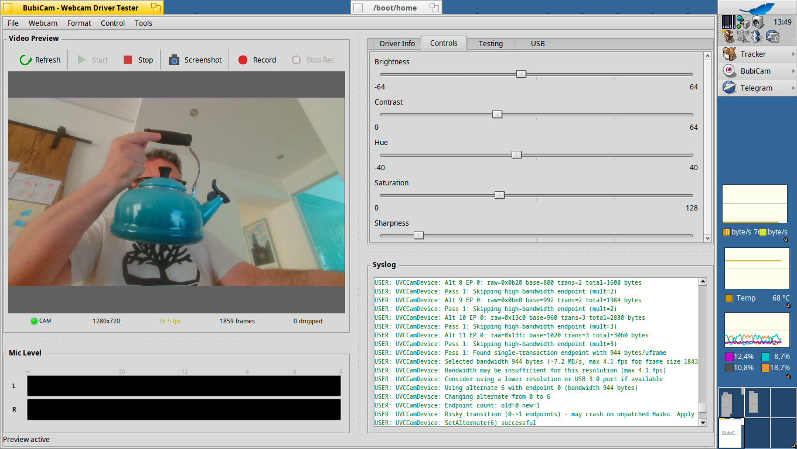

# UVC Webcam Driver for Haiku

Native USB Video Class driver for Haiku OS. Plug in a UVC webcam and use it
with MediaPlayer, Cortex, BubiCam, or any media node consumer. Supports MJPEG
and uncompressed formats up to 1080p, audio capture from built-in microphones,
and the full UVC control surface (brightness, focus, exposure, white balance,
zoom, etc.).



If this driver saves you a Windows reboot, consider supporting development:
[](https://buymeacoffee.com/atomozero)


## Features

* MJPEG (HD recommended), YUY2/YUYV, UYVY, NV12, NV21, YV12, I420, GREY
* Multi-stream cameras exposed as separate media nodes (RealSense, stereo)
* Built-in microphone via USB Audio Class 1.0
* Full UVC controls: brightness, contrast, saturation, focus, zoom, exposure,
  white balance, gain, backlight compensation, anti-flicker
* Multi-camera support with unique device naming and hot-plug
* Automatic resolution fallback when bandwidth is insufficient
* Optional face detection (bounding boxes only, opt-in, off by default)
* Extension Unit detection (Sonix, Microsoft H264, Logitech, Realtek)
* No external dependencies beyond Haiku system libraries and libturbojpeg

## Quick start

```
make
make install
kill $(pidof media_server)
```

Open MediaPlayer, Cortex, or BubiCam — the webcam appears as a video node.


## Supported devices

| Device | VID:PID | Status |
|---|---|---|
| AUKEY PC-LM1E | 1BCF:0001 | Working — MJPEG up to 1280x720, audio OK |
| Realtek USB Camera | 0BDA:5843 | Working — MJPEG + YUY2 |
| Chicony CNF8111 | 04F2:B119 | Working |
| SuYin HP Truevision | varies | Working with kernel patch |
| Microdia Motion Eye | 0C45:6409 | YUY2 tearing — firmware limitation |
| Generic UVC webcams | any | Auto-detected |

MJPEG webcams are recommended. YUY2-only cameras can show tearing on USB 2.0
due to bandwidth constraints.

## Build

Requires Haiku R1/beta5 or nightly, GCC, and `libturbojpeg`:

```
pkgman install libturbojpeg_devel
```

Then:

```
make              # build the media addon
make install      # install to ~/config/non-packaged/add-ons/media/
make dist-zip     # build a distributable archive
```

## Troubleshooting

**Camera not detected**
```
listusb | grep -i video
tail -f /var/log/syslog | grep -i uvc
```

**Stuttering or tearing**
Switch to MJPEG format if available, or lower the resolution. Avoid USB 2.0
hubs for HD cameras.

**No audio**
The webcam node is video-only; the microphone shows up as a separate
"[Camera Name] Audio" node in Media preferences.

**Kernel panic on resolution change**
Affects older Haiku versions only (Haiku bug in `BUSBInterface::SetAlternate()`).
Update to a recent nightly, or apply the patches in `patches/`.

## Environment variables

| Variable | Effect |
|---|---|
| `WEBCAM_DEBUG=verbose` | Verbose probe and parameter logging |
| `WEBCAM_FORCE_HIGH_BANDWIDTH=1` | Allow `mult>1` isochronous endpoints (needs patched kernel) |
| `WEBCAM_DISABLE_HIGH_BANDWIDTH=1` | Force `mult=1` only (default) |
| `WEBCAM_MJPEG_QUALITY=N` | Pin MJPEG `wCompQuality` (0..10000) |
| `WEBCAM_PROBE_DELAY=N` | Extra ms before probe/commit (default 100) |
| `WEBCAM_FACE_DETECT=1` | Enable face detection overlay (`quiet` = detect + log only, no boxes) |
| `WEBCAM_FACE_DETECT_INTERVAL=N` | Analyse every Nth frame (default 3, range 1..60) |
| `WEBCAM_FACE_AE_LOCK=1` | Freeze auto-exposure/white balance while a face is in view |

Set them in the shell that launches `media_server`.

## Face detection

Setting `WEBCAM_FACE_DETECT=1` turns on an optional, self-contained face
*detector* — it draws green boxes around faces in the video stream. It is a
lightweight heuristic (skin-region + geometry), not a neural network, so it
adds no external dependencies and only runs every few frames to stay off the
real-time path. It reports *where* faces are; it does **not** identify *who*
a person is. The feature is off unless the variable is set, so cameras used by
everyone else are unaffected. For identity recognition, run a separate consumer
application against the media node — that work does not belong in the driver.

When detection is on, the node also publishes the detected regions on its
parameter web as a read-only text parameter named **Faces**, so an external
recognition app can crop just those regions instead of re-scanning every frame.
The value is ASCII encoded:

```
<frameWidth> <frameHeight> <count> [x y w h]...
```

for example `640 480 2 200 150 120 160 470 180 90 110` (coordinates in
full-resolution pixels). Read it with `BControllable::GetParameterValue()` or
watch it via the Media Kit's parameter-change notifications.

Setting `WEBCAM_FACE_AE_LOCK=1` additionally lets the driver help the *image*:
while a face is in view it freezes the camera's auto-exposure and auto white
balance (using UVC controls the app cannot reach), so brightness and skin tone
stay stable across frames — which keeps recognition embeddings consistent. The
automatic modes are restored when the face leaves the frame or streaming stops.
Requires a camera that exposes AE-mode / WB-auto controls.

## Diagnostic tools

The `tools/` directory contains standalone utilities for debugging webcam
issues — Sonix register probing via UVC Extension Units, EHCI iTD offset
simulation, YUV/RGB frame conversion, and tearing analysis. Build any tool
with `g++ -O2 -o NAME NAME.cpp -lbe -ldevice`.

## Be careful

> **Developer's Note**: This software may contain traces of peanuts and LLM.
> It has been developed with passion for the Haiku platform.

## Support

If you find this project useful, you can buy me a coffee:
[](https://buymeacoffee.com/atomozero)

## Credits

Original driver by Ithamar Adema, Jérôme Duval, Gabriel Hartmann.
UVC improvements and optimizations 2024-2026.
