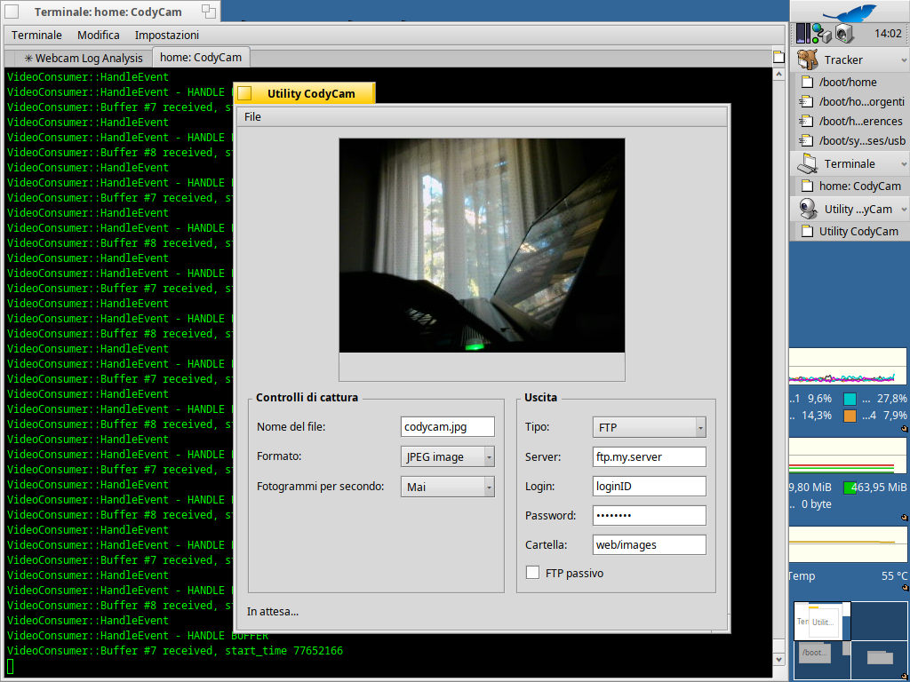
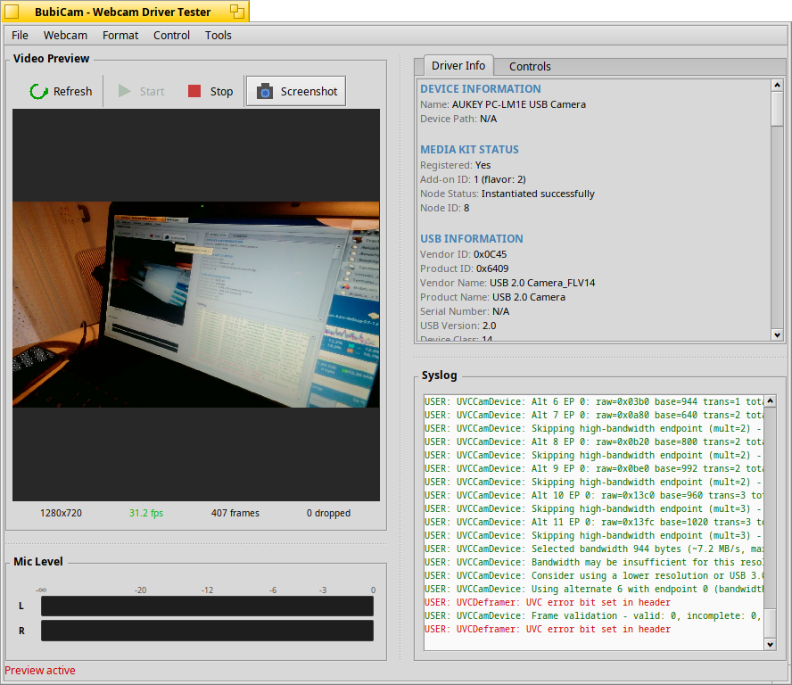

# UVC Webcam Driver for Haiku

A USB Video Class (UVC) driver for Haiku OS, providing support for standard USB webcams with video and audio capabilities.

## Screenshots





## Features

### Video Support
- **MJPEG** - Compressed format, recommended for HD resolutions (720p, 1080p)
- **YUY2** - Uncompressed format, lower latency for video conferencing
- **NV12** - YUV 4:2:0 planar format, reduced bandwidth

### Camera Controls
- **Processing Unit**: Brightness, Contrast, Saturation, Sharpness, Gamma, Hue
- **White Balance**: Temperature, Auto mode
- **Exposure**: Auto/Manual modes, Exposure time
- **Focus**: Auto/Manual focus, Zoom
- **Other**: Backlight compensation, Gain, Power line frequency (anti-flicker)

### Audio Support
- USB Audio Class 1.0 for webcams with built-in microphones
- Automatic detection and separate audio node creation

### Advanced Features
- Multi-camera support with unique device naming
- Hot-plug with parameter persistence
- Automatic resolution fallback on bandwidth issues
- USB 3.0 (XHCI) and USB 2.0 (EHCI) controller optimization
- Extension Unit detection for vendor-specific features

## Supported Devices

| Device | VID:PID | Status |
|--------|---------|--------|
| AUKEY PC-LM1E | 1BCF:0001 | Full support |
| Sonix USB 2.0 Camera | 0C45:6409 | Full support |
| Realtek USB Camera | 0BDA:5843 | Supported |
| Generic UVC webcams | Various | Should work |

The driver auto-detects any UVC-compliant webcam. Devices not in the list may still work.

## Installation

### From Source

```bash
# Build
make

# Install to user add-ons
make install

# Restart media services
media_client quit
media_client launch
```

### Manual Installation

Copy `aukey_webcam_v4.media_addon` to:
```
/boot/home/config/non-packaged/add-ons/media/
```

## Build Requirements

- Haiku OS (nightly or R1/beta4+)
- GCC compiler
- libturbojpeg (`pkgman install devel:libturbojpeg`)

## Usage

After installation and media server restart:

1. Open **MediaPlayer** or **Cortex**
2. The webcam appears as a video producer node
3. Connect it to a video consumer (window, recorder, etc.)

### Testing with Cortex

1. Launch Cortex from Deskbar > Applications
2. Find your camera node (e.g., "AUKEY PC-LM1E USB Camera")
3. Drag a connection to "Video Window"
4. Double-click the camera node to access controls

## Troubleshooting

### Camera not detected

```bash
# Check if device is recognized
listusb | grep -i video

# Check driver loading
tail -f /var/log/syslog | grep -i uvc
```

### Poor video quality or stuttering

1. Try lower resolution (640x480)
2. Use MJPEG format instead of YUY2 for HD
3. Check USB connection (avoid hubs for USB 2.0 cameras)

### No audio from webcam microphone

- Ensure the webcam has a built-in microphone
- Check Media preferences for audio input selection
- Audio node appears as "[Camera Name] Audio"

### Kernel panic on resolution change

This is fixed in the driver. If you experience issues:
1. Avoid changing resolution while streaming
2. Stop the stream before changing settings

## Diagnostics

### UVC Benchmark Tool

```bash
cd tests
g++ -O2 -o uvc_benchmark uvc_benchmark.cpp -lbe -ldevice
./uvc_benchmark
```

Shows detailed UVC compliance and compatibility score.

### Debug Logging

Set environment variable before launching media services:
```bash
export WEBCAM_DEBUG=verbose
media_client quit
media_client launch
```

Debug levels: `none`, `error`, `warn`, `info`, `verbose`, `trace`

## Architecture

```
┌─────────────────────────────────────────────────────┐
│                  Media Kit                          │
├─────────────────────────────────────────────────────┤
│  VideoProducer    │    AudioProducer               │
├───────────────────┴─────────────────────────────────┤
│                   CamDevice                         │
│  (Frame buffering, USB transfers, deframing)        │
├─────────────────────────────────────────────────────┤
│                 UVCCamDevice                        │
│  (UVC protocol, format negotiation, controls)       │
├─────────────────────────────────────────────────────┤
│                   CamRoster                         │
│  (USB device discovery, hot-plug handling)          │
├─────────────────────────────────────────────────────┤
│               Haiku USB Stack                       │
└─────────────────────────────────────────────────────┘
```

## Performance Optimizations

- **YUV-RGB Lookup Tables**: Pre-computed conversion tables for faster color space conversion
- **Frame Pool Recycling**: Reduces memory allocation overhead
- **Double Buffering**: Improved USB transfer efficiency
- **Adaptive Timeout**: Dynamic timeout based on actual frame timing
- **Log Throttling**: Reduced syslog overhead in production

## Known Limitations

- Still image capture: Detection only (no hardware trigger support)
- USB 1.1 (OHCI/UHCI): Limited bandwidth, low resolutions only
- Some vendor Extension Units: Detected but controls not exposed

## License

Distributed under the MIT License. See source files for details.

## Credits

- Original driver: Ithamar Adema, Jérôme Duval, Gabriel Hartmann
- UVC improvements and optimizations: 2024-2025 contributors

## Links

- [Haiku OS](https://www.haiku-os.org/)
- [USB Video Class Specification](https://www.usb.org/document-library/video-class-v15-document-set)
